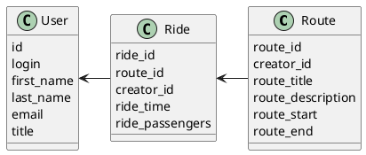

# Компонентная архитектура
<!-- Состав и взаимосвязи компонентов системы между собой и внешними системами с указанием протоколов, ключевые технологии, используемые для реализации компонентов.
Диаграмма контейнеров C4 и текстовое описание. 
-->
## Компонентная диаграмма

```plantuml
@startuml
!include https://raw.githubusercontent.com/plantuml-stdlib/C4-PlantUML/master/C4_Container.puml

AddElementTag("microService", $shape=EightSidedShape(), $bgColor="MediumSeaGreen", $fontColor="white", $legendText="microservice")
AddElementTag("storage", $shape=RoundedBoxShape(), $bgColor="LightGreen", $fontColor="white")
AddElementTag("person", $bgColor="Teal", $fontColor="white")

Person(admin, "Администратор")
Person(moderator, "Модератор")
Person(user, "Пользователь")

System_Ext(web_site, "Клиентский веб-сайт", "HTML, CSS, JavaScript, React", "Веб-интерфейс")

System_Boundary(travel_site, "Backend сервиса поиска попутчиков") {
   Container(client_service, "Сервис управления пользователями", "C++", "Сервис регистрации, авторизации, поиска пользователей", $tags = "microService")  
   Container(route_service, "Сервис маршрутов", "C++", "Сервис создания и просмотра маршрутов", $tags = "microService") 
   Container(ride_service, "Сервис поездок", "C++", "Сервис создания и просмотра поездок", $tags = "microService")   
   ContainerDb(db, "База данных", "MySQL", "Хранение данных о пользователях, маршрутах ипоездках", $tags = "storage")
   ContainerDb(cache, "Кэш", "Redis", "Хранение данных о пользователях", $tags = "storage")
   
}

Rel(admin, web_site, "Просмотр, добавление и редактирование информации о пользователях, маршрутов и поездок")
Rel(moderator, web_site, "Модерация контента и пользователей")
Rel(user, web_site, "Регистрация, вход на страничку и поиск пользователей, создание и просмотр маршрутов, создание и просмотр поездок")


Rel(web_site, client_service, "Работа с пользователями")
Rel(client_service, cache, "Получение данных из кеша")
Rel(cache, db, "INSERT/SELECT/UPDATE", "SQL")


Rel(web_site, route_service, "Работа с маршрутами", "localhost/route")
Rel_D(route_service , db, "INSERT/SELECT/UPDATE", "SQL")


Rel(web_site, ride_service, "Работа с поездками", "localhost/ride")
Rel(ride_service, db, "INSERT/SELECT/UPDATE", "SQL")
@enduml

```
## Список компонентов  

### Сервис авторизации
**API**:
-	Создание нового пользователя
      - входные параметры: login, пароль, имя, фамилия, email, обращение (г-н/г-жа)
      - выходные параметры: отсутствуют
-	Поиск пользователя по логину
     - входные параметры:  login
     - выходные параметры: имя, фамилия, email, обращение (г-н/г-жа)
-	Поиск пользователя по маске имени и фамилии
     - входные параметры: маска фамилии, маска имени
     - выходные параметры: login, имя, фамилия, email, обращение (г-н/г-жа)

### Сервис маршрутов
**API**:
- Создание маршрута
  - Входные параметры: автор, название маршрута, описание, начало пути, конец пути
  - Выходыне параметры: идентификато маршрута
- Получение списка всех блогов
  - Входные параметры: идентификаотр пользователя
  - Выходные параметры: массив с маршрутами (названия, описания, начала и концы пути)

### Сервис поездок
**API**:
- Создание поездки
  - Входные параметры: автор, идентификатор поездки, время начала поездки
  - Выходные параметры: идентификатор поездки
- Получение информации о поездке
  - Входные параметры: идентификатор поездки
  - Выходные параметры: массив с поездкой
- Добавление пользователей к поездке
  - Входные параметры: идентификатор поездки, идентификатор пользователя
  - Выходные параметры: отсутствуют


### Модель данных
